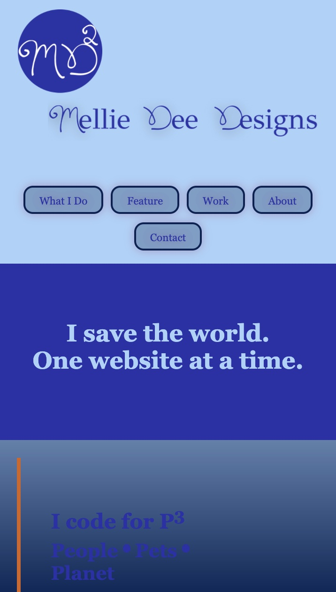
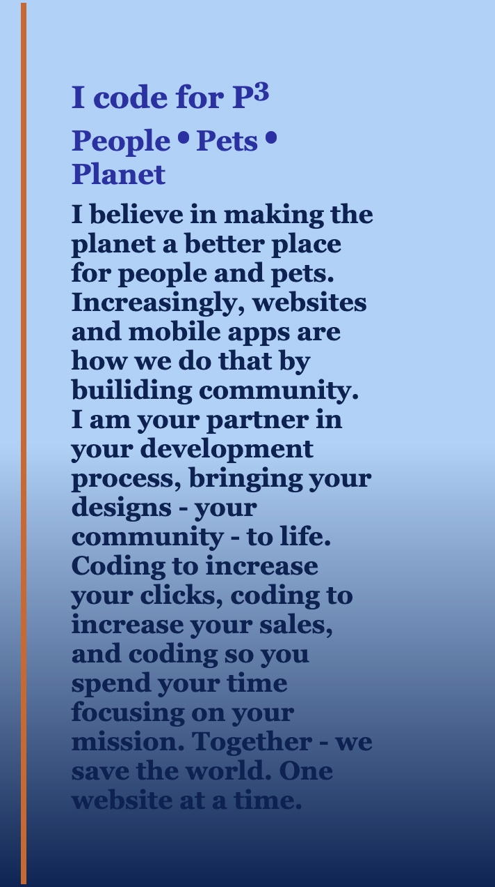
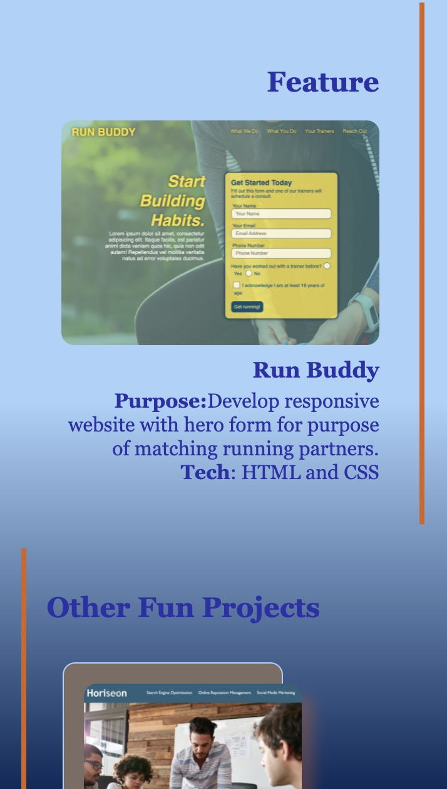
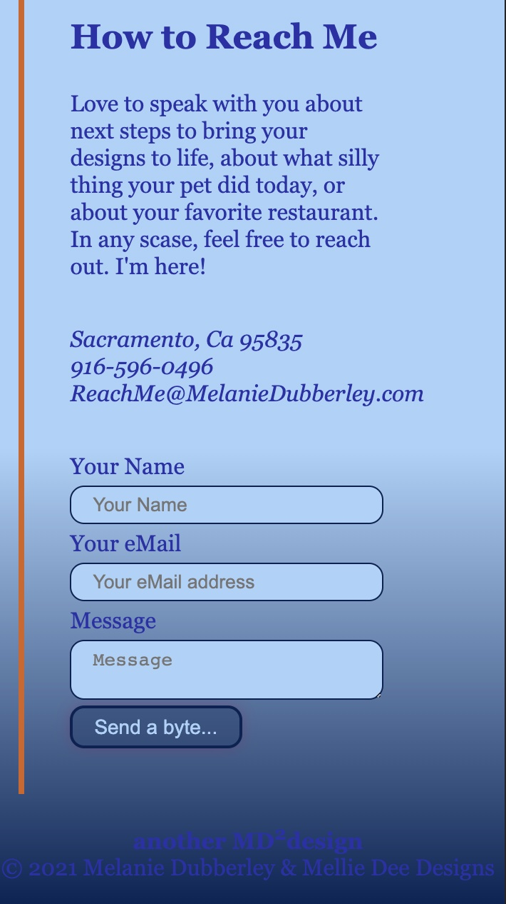
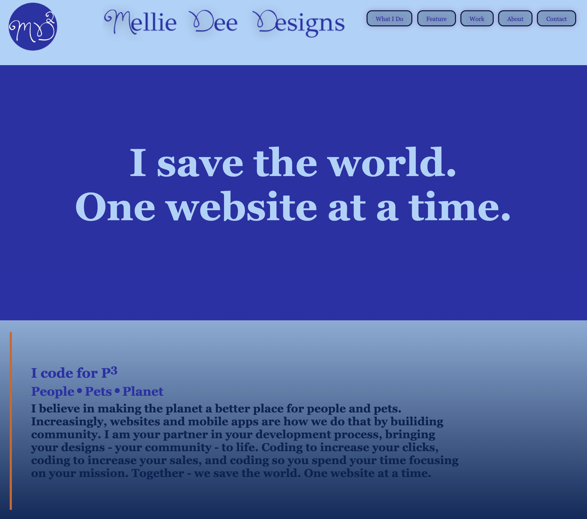
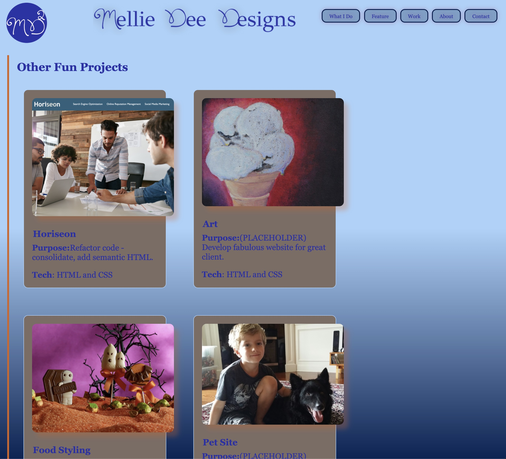

# Mellie Dee Portfolio
Porfolio showcasing projects and experience.

&nbsp;&nbsp;&nbsp;

## Purpose
***
To develop a portfolio as per specified acceptance criteria including:

- Name
- Recent photo
- Featured work with larger image
- Other projects
- Functioning links to sections within the page and to deployed projects where applicable
- About section

&nbsp;&nbsp;&nbsp;

## Portfolio URL

***

Link to the refactored home page here *[Mellie Dee Portfolio](https://melliedee.github.io/portfolio/)*.

&nbsp;&nbsp;&nbsp;

### Screen Shots - Mobile
***

&nbsp;

&nbsp;

&nbsp;

&nbsp;

### Screen Shots - Desktop
***

&nbsp;

&nbsp;&nbsp;&nbsp;&nbsp;

## Additional Notes
***
### CSS organization in the order
Design for 320px screen first. MQ increase in screen size.

Generally speaking it is organized as follows however, because of cosolidation, some sections are combined:
- Global
- Reset
- Uiversal/Utility
- Font/Headers
- Images
- Elements/Selectors/Classes in HTML order (mostly -see note above)
- Media Queries
- Generally, subgroups appear in their in HTML order
&nbsp;&nbsp;&nbsp;&nbsp;

## I found the following websites useful
***

https://sympli.io/blog/heres-everything-you-need-to-know-about-favicons-in-2020/

https://mathiasbynens.be/notes/touch-icons

https://www.w3.org/2005/10/howto-favicon

https://favicon.io/favicon-converter/

https://www.iconfinder.com/icons/5282542/linkedin_network_social_network_linkedin_logo_icon

https://www.youtube.com/watch?v=YpNRnYAygDs&list=PL4cUxeGkcC9hH1tAjyUPZPjbj-7s200a4&index=2

https://brand.linkedin.com/downloads

https://www.youtube.com/watch?v=k32voqQhODc

https://www.youtube.com/watch?v=cLNkfWphGMk&list=PL4cUxeGkcC9hH1tAjyUPZPjbj-7s200a4&index=6

&nbsp;&nbsp;&nbsp;

#### Other things I was exploring
***

  - accent-color2: rgba(150, 7, 88, 1.0); #960758
  - CSS Grid
  - still woking on a style-guide of sorts for creating consistency in class creation
  -- simiarly still devising what my preferred order of CSS selectors is
